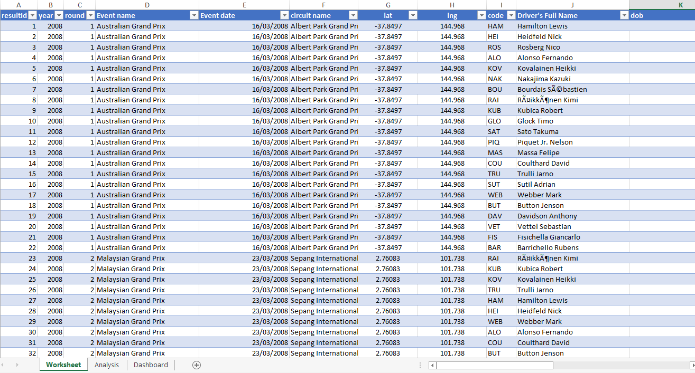
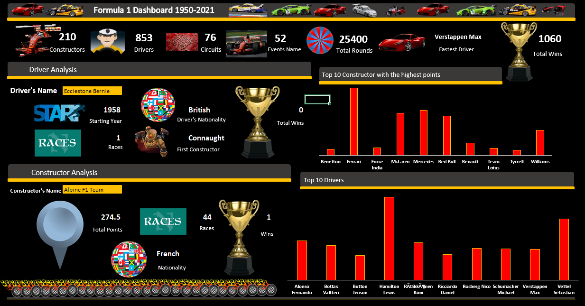

# Formula-1-Car-Race-Analysis
This is a car race competition analysis showing all KPIs , drivers analysis and constructors analysis at a glance utilizing the interactive features in Microsoft Excel. The picture below is gotten from [freepiks website](https://www.freepik.com/free-photo/close-up-fuel-level-gauge-vehicle_94965627.htm#query=car%20race%20competition%20analysis&position=8&from_view=search&track=ais&uuid=77338502-f73c-450e-b66c-1b672ae6bddb)

## Introduction
This project reveals important metrics in car race competition from 1950 – 2021. The dataset contains information about drivers, car constructors, drivers nationality, event name, date, driver’s points, position and so on. This dashboard was analyzed and built on Microsoft Excel and shows my ability on how to use interactive features effectively. 

## Problem Statement
The analysis must generate answers to the following questions:
* Which driver has the most wins?
* How many races has each car constructor participated in?
* Which car constructor has the highest average finishing position?
* How many car constructors are represented in the dataset?
* What is the total number of races?
* What are the nationalities of the drivers?
* How many points does each constructor have in the championship?
* What are the points distribution for top drivers?

## Data Source
The data used for this work is gotten from DahelTechies Internship Program. One of the project I worked on during my internship program. 

## Skills and Concepts demonstrated
The following are some of the Excel skills and concept demonstrated during the project:
* Data Validation
* Dynamic Named Ranges
* Dashboard Design and Layout
* Using advanced functions such as index-match, countifs and so on
* Designing a User Experience (UX) interface
* Interactive Elements
* Branding and Color Coordination

## Data Analysis
I checked for missing data and changed each columns to their appropriate data types.

I Created pivot tables and customized the charts 

I performed lots of calculations in the dataset, aggregated and presented data in a concise format.

I extracted specific information from datasets

I set up drop-down lists using data validation techniques to show details of each driver and constructor selected

* Data Preview

## Data visualization
Selected and incorporated appropriate cliparts

Chose colors that harmonize with the overall dashboard theme and maintained a consistent theme throughout the dashboard

Created a user-friendly interface for interactivity

Designing an organized and visually appealing layout.

* Dashboard

  
## Summary
* The number of rounds were totaled to 25400 with 853 drivers and 210 constructors, and the fastest driver ever is ‘VerVerstappen Max’
* The total wins right from the beginning of the competition 1950 to 2021 amount to 1060
* In driver's and constructor's analysis segment, important details about driver and constructor selected from the dropdown are shown such as their nationality, number of wins, total points, number of races and so on.
* Top drivers with the highest points and top constructors are shown on chart to easily identify top drivers and constructors by their points

## Thank you for reading.
I am open to data roles.
